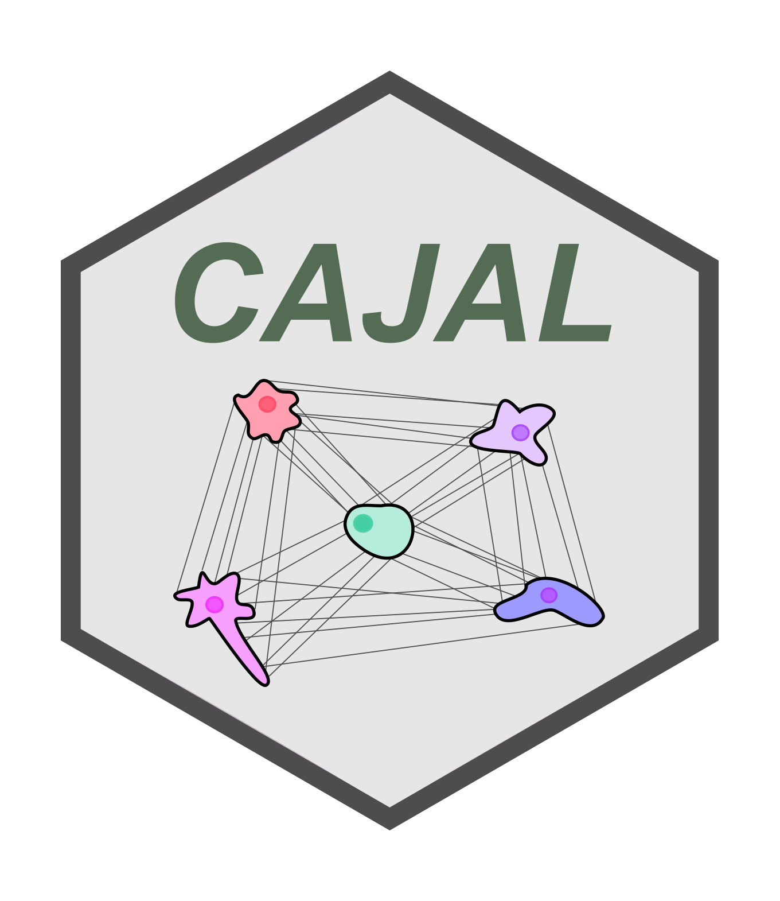

# CAJAL <a href='https://github.com/CamaraLab/CAJAL'></a>
[](https://github.com/CamaraLab/CAJAL/actions/workflows/python-package.yml)
[](https://codecov.io/github/CamaraLab/CAJAL)


CAJAL is a Python library for multi-modal cell morphology analyses using Gromov-Wasserstein (GW) distance. Detailed information about the methods implemented in CAJAL can be found in:

K. W. Govek, P. Nicodemus, Y. Lin, J. Crawford, A. B. Saturnino, H. Cui, K. Zoga, M. P. Hart, P. G. Camara, _CAJAL enables analysis and integration of single-cell morphological data using metric geometry_. **Nature Communications** 14 (2023) 3672. [DOI:10.1038/s41467-023-39424-2](https://doi.org/10.1038/s41467-023-39424-2)

## Installation
CAJAL is hosted on the Python Package Index - https://pypi.org/project/cajal/

It is recommended to install CAJAL via pip, which should automatically retrieve the correct wheel for your platform and Python version. It is strongly recommended to create a [virtual environment](https://docs.python.org/3/library/venv.html).
```commandline
pip install cajal
```
Installation on a standard desktop computer should take a few minutes.

----

CAJAL can be also built from source, by cloning the Github repository.

```commandline
pip install git+https://github.com/CamaraLab/CAJAL.git
```

To build CAJAL from source, a C++ compiler is required for the Gromov-Wasserstein computation and may be required for the potpourri3d library if the precompiled binaries are not compatible with your system.
On Windows, we recommend Microsoft Visual C++ 14.0 or greater, which can be installed via the [Microsoft C++ Build Tools](https://visualstudio.microsoft.com/visual-cpp-build-tools/). On Ubuntu, it requires g++ and may require the package python3.x-dev, which registers the Python header files with g++.
The Unbalanced Gromov-Wasserstein module requires a Gnu C compiler, such as is available through MinGW, and a library implementing pthreads on windows.

CAJAL contains numerous dependencies which are currently hosted only on PyPI; as such, it is not possible at this time to provide a CAJAL conda package. (conda packages require all their dependencies to also be conda packages.) However, it should be possible to install CAJAL in a conda is conscious of, using a conda-managed Python installation and calling pip from within a conda environment.

----

The easiest way to run CAJAL is via [Jupyter](https://jupyter.org/). Install Jupyter with
```commandline
pip install notebook
```
Then start up Jupyter from terminal / Powershell using
```commandline
jupyter notebook
```

## Docker image
We provide a Docker image which contains CAJAL and its dependencies, ```cajal:latest``` is built on top of the Docker image ```tensorflow-notebook``` and contains numerous data science tools for further analysis of the output of CAJAL. Running the following command will launch a Jupyter notebook server on localhost with CAJAL and its dependencies installed:
```commandline
docker run -it -p 8888:8888 -v C:\Users\myusername\Documents\myfolder:/home/jovyan/work camaralab/cajal:latest
```
The ```-p``` flag controls the port number on local host. For example, writing ```-p 4264:8888``` will let you access the Jupyter server from 127.0.0.1:4264. The ```-v``` "bind mount" flag allows one to mount a local directory on the host machine to a folder inside the container so that you can read and write files on the host machine from within the Docker image. Here one must mount the folder on the host machine as /home/jovyan/work or /home/jovyan/some_other_folder as the primary user "jovyan" in the Docker image only has access to that directory and to the /opt/conda folder. See the [Jupyter docker image documentation](https://jupyter-docker-stacks.readthedocs.io/en/latest/using/selecting.html) for more information.

## Documentation
Extensive documentation, including several tutorials, can be found in [CAJAL's readthedocs.io website](https://cajal.readthedocs.io/en/latest/index.html).

## New in this release
Version 1.5 of CAJAL incorporates two significant new pieces of functionality for the analysis of neuron morphology, unbalanced Gromov-Wasserstein (a matching tool which allows for partial or incomplete matches) and fused Gromov-Wasserstein (a tool which allows the incorporation of additional feature data about neuron nodes, e.g., soma or dendrite.)
