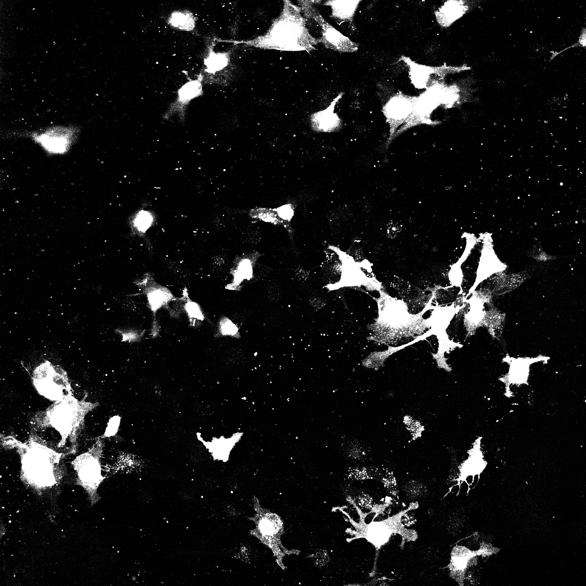
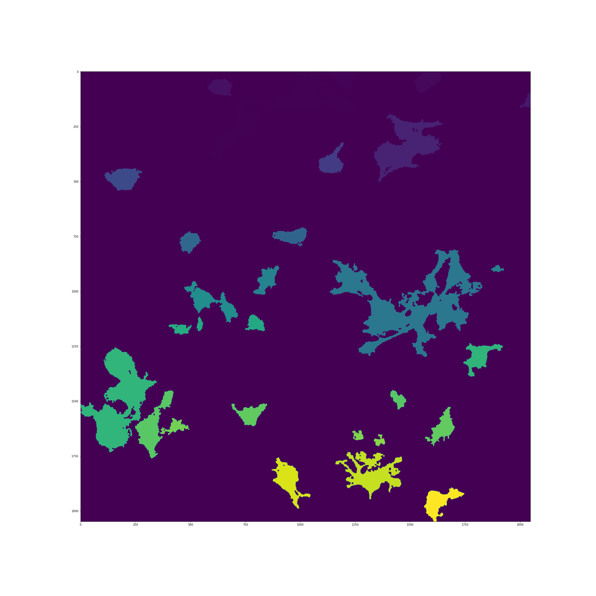

Computing Intracellular Distance Matrices
=========================================

CAJAL represents a cell as a finite set of uniformly sampled points from its outline
together with a notion of distance between each pair of points. This cell data is
internally represented as an intracellular distance matrix, where each rows and column
corresponds to a point in the cell, and the entry at position (i, j) denotes the
distance between points x_i and x_j. Typically, 50 to 200 sampled points per cell
are sufficient for most applications.

To compute the Gromov-Wasserstein
distance between two cells, users need to first convert their cell morphology
data into intracellular distance matrices. In this regard, CAJAL offers functionality that
supports three kinds of input data files neuronal tracing data (SWC files),
3D meshes (OBJ files), and 2D cell segmentation files (TIFF files). This section
describes how to leverage this functionality to produce intracellular distance
matrices that enable users to perform Gromov-Wasserstein distance computations.

Euclidean vs. geodesic distances
--------------------------------

CAJAL supports two types of intracellular distances matrices\: Euclidean distance,
which is the ordinary straight-line distance through the ambient space,
and geodesic distance, which is the length of the shortest path through the
surface of the cell. The choice between using Euclidean or geodesic distance
affects the types of deformations that CAJAL considers relevant when comparing
the shape of two cells.

Using Euclidean distance to measure intracellular distances results in
morphological distances that are insensitive to translations, rotations, or
mirroring of a cell. However, bending or flexing a cell will change the
morphological distance between that cell and other cells.  On the other hand,
using geodesic intracellular distances leads to morphological distances that
are insensitive to translations, rotations, mirroring, bending, and flexing of
the cells.

To illustrate the distinction, consider two pieces of string, A
and B, both of which are twelve inches long. If A is laid out in a straight line
and B is tightly coiled, then the Gromov-Wasserstein distance between them will
be nontrivial in they are represented by Euclidean intracellular distance matrices.
This is because one must bend B to straighten it out into a line segment. However, if
they are represented by their geodesic distance matrices, then the
Gromov-Wasserstein distance will be zero. This is because one can deform A into B
without any stretching or elongating, as they are the same length. 

Neuronal Tracing Data
---------------------

CAJAL supports neuronal tracing data in the SWC specification defined `here
<http://www.neuronland.org/NLMorphologyConverter/MorphologyFormats/SWC/Spec.html>`_.
You can find examples of \*.swc files compatible with CAJAL can be found in the CAJAL Github
repository under ``CAJAL/data/swc_files``.

The package provides two functions that operate on directories of *.swc files.
:func:`cajal.sample_swc.compute_and_save_intracell_all_euclidean` and :func:`cajal.sample_swc.compute_and_save_intracell_all_geodesic`. These functions
generate intracellular distance matrices for each cell in the source directory
and populate a \*.csv file with the results.

For example, if you have a directory called `/home/jovyan/CAJAL/CAJAL/data/swc_files`
that contains *.swc files and you want to write the intracellular distance
matrices to a *.csv file called `/home/jovyan/CAJAL/CAJAL/data/swc_icdm.csv`,
you can use the following code.

.. code-block:: python

		failed_cells = sample_swc.compute_and_save_intracell_all_euclidean(
                    infolder = "/home/jovyan/CAJAL/CAJAL/data/swc_files",
		    out_csv= "/home/jovyan/CAJAL/CAJAL/data/swc_icdm.csv",
		    n_sample = 50,
		    preprocess=swc.preprocessor_eu(
		        structure_ids=[1,3,4],
			soma_component_only=True),
		    num_cores = 8
		    )

The `n_sample` argument specifies the number of points from each cell that will be
sampled (we recommend between 50-100). The `num_cores` argument specifies the
number of processes that will be launched in parallel, and we recommend setting
it to the number of cores on your machine.

The `preprocess` argument is optional and can be used to filter out some neurons
from being sampled, for reasons of data quality, and/or transform the remaining
data before sampling from it. The argument is very flexible and can be used
in many ways. For convenience, two specific use cases are built-in.
The line `structure_ids = [1,3,4]` indicates that samples will only
be drawn from the node types corresponding to 1, 3 and 4 in the SWC specification, i.e.,
the soma and basal and apical dendrites. This can be useful when the user
has a mixture of full neuronal reconstructions and dendrite-only neuronal reconstructions and
wants to discard the axons from the full neuronal reconstructions. To keep all node types,
set `structure_ids = "keep_all_types"`. The argument
`soma_component_only=True` indicates that the function will only sample from the
unique component of the neuron containing the soma, and will write to an error log any
neurons which do not contain a unique component containing nodes labeled as soma.
This illustrates the basic function of the preprocessing function, in this example
filtering out all neurons which don't have a unique soma node, and transforming
the remaining neurons by discarding all components except the one
containing the unique soma node. To keep all connected
components, set `soma_component_only=False`.

The function returns a list called `failed_cells` that contains the names of
the cells for which sampling was unsuccessful (i.e., the preprocessing function
returned an error) together with the error itself. If the sampling is successful,
the results are silently written to a file.

A similar functionality is implemented in :func:`cajal.sample_swc.compute_and_save_intracell_all_geodesic`
with respect to the computation of intracellular geodesic distances.
		    
3D meshes
---------

CAJAL provides support for Wavefront \*.obj 3D mesh files. The package expects each
line of a mesh file to be one of the following.

- A comment, marked with a "#"
- A vertex, written as `v float1 float2 float3`
- A face, written as `f linenum1 linenum2 linenum3`

Examples of \*.obj files compatible with CAJAL can be found in the CAJAL Github
repository under the folder ``CAJAL/data/obj_files``.

It is important to note that a \*.obj file may contain several distinct connected
components. By default, CAJAL separates these components into individual cells.
However, in situations where a \*.obj file is supposed to represent a single cell
but has multiple disconnected components due to measurement errors, the
package provides functionality to create a new mesh where all components are
joined together by new faces. This allows for the computation of a geodesic
distance between points in the mesh. If the user wants to compute the
Euclidean distance between points, such repairs are unnecessary, as the Euclidean
distance is insensitive to connectivity.

CAJAL provides one batch-processing function that goes through all \*.obj
files in a given directory, separates them into connected components, computes
intracellular distance matrices for each component, and writes all these square
matrices to a \*.csv file. For example,

.. code-block:: python

		failed_samples = sample_mesh.compute_and_save_intracell_all(
		            infolder="/home/jovyan/CAJAL/data/obj_files",
			    out_csv="/home/jovyan/CAJAL/data/sampled_pts/obj_geodesic_50.csv",
			    metric = "segment",
			    n_sample=50,
			    num_cores=8,
			    segment = True,
			    method="heat"
			    )

The arguments `infolder, out_csv, n_sample, metric` are as in :ref:`Neuronal
Tracing Data`, except that `infolder` is a folder containing \*.obj files
rather than \*.swc files.

If the Boolean flag `segment` is True, the function will break down each \*.obj
file into its connected components and treat them as individual, isolated
cells.  If `segment` is set to False, the function will treat each \*.obj file as a
single cell.  If the user chooses the "geodesic" metric and the contents of a
\*.obj file are not connected, CAJAL will automatically attempt to "repair" the
cell by modifying it to adjoin new paths between connected components, so that
a geodesic distance between points can be defined.

.. warning::

   Modifying the data by adjoining new triangles to the mesh is an imputation of
   data which changes its topology. This presents the same thorny questions as
   in any other scenario when data is imputed, and the user should keep this in
   mind while interpreting the data. The functionality of "repairing" the cell
   is premised on the assumption that the \*.obj file represents a single
   geometric object and that it fails to be connected for trivial
   reasons. If a \*.obj file genuinely contains multiple distinct components,
   then the geodesic distances resulting from this process will not be meaningful.

Segmentation files 
-------------------

Image segmentation is the process of separating an image into distinct components
to simplify the representations of objects. Morphological segmentation is one
approach to image segmentation based on morphology. While CAJAL provides tools
to sample from the cell boundaries of segmented image files, it is important
to note that CAJAL is not a tool for image segmentation itself. Users are expected
to segment and clean their own images.

To help users prepare their data for use with CAJAL, we provide a basic example
using images from the CAJAL Github repository (``CAJAL/data/tiff_images``).

Let us consider the following image

The OpenCV package provides some basic functionality to clean image data and
perform segmentation. Users can use the :func:`cv.imread` function to load \*.tiff
files into memory.

.. code-block:: python

        import tifffile

        img=tifffile.imread(CAJAL/data/tiff_images/epd210cmd1l3_1.tif)

We then recommend collapsing the greyscale image to black and white and performing
dilation followed by erosion and erosion followed by dilation to remove noise
and small holes.

.. code-block:: python

        import cv2 as cv
        import numpy as np

        _, thresh = cv.threshold(img,100,255,cv.THRESH_BINARY)
        kernel = np.ones((5,5),np.uint8)
        closing = cv.morphologyEx(thresh, cv.MORPH_CLOSE, kernel)
        closethenopen = cv.morphologyEx(closing, cv.MORPH_OPEN,kernel)

Afterward, users can label each connected region of the image with a unique
common color.

.. code-block:: python

        from skimage import measure

        labeled_img = measure.label(closethenopen)

The image is still somewhat noisy, with a few specks in it. To despeckle it, we can
remove all connected regions with fewer than 1000 pixels by grouping them into the
background region, which is labelled with 0.

.. code-block:: python

        labels = np.unique(labeled_img, return_counts=True)
        labels = (labels[0][1:],labels[1][1:])
        remove = np.isin(labeled_img, labels[0][labels[1]<1000])
        img_keep = labeled_img.astype(np.uint8)
        img_keep[remove] = 0

We can use matplotlib to view the image from an interactive environment like Jupyter notebook.

.. code-block:: python

        import matplotlib.pyplot as plt
        fig, ax = plt.subplots()
        ax.imshow(simplify_img_keep)
        fig.set_size_inches(30, 30)
        plt.show()

This image is representative of the type of images that CAJAL is meant to
process\: a 2D array of integers, where each cell is represented by a connected
block of integers with the same value. Two distinct cells should have different
values, and each cell should have a different value than the background.

We can write the cleaned image to a file using ``tifffile.imwrite()``.

.. code-block:: python

        tifffile.imwrite('/home/jovyan/CAJAL/CAJAL/data/cleaned_file.tif',
        img_keep, photometric='minisblack')

It is essential to note that this is only a toy example. For instance, in this
image multiple overlapping cells have been grouped into a single mask. Users would
normally discard such overlapping cells before analysis with CAJAL.

To sample points and compute intracellular distances from \*.tiff / \*.tif files
like these, CAJAL provides the function
:func:`cajal.sample_seg.compute_and_save_intracell_all`. This function takes
an input directory full of cleaned \*.tiff/\*.tif files and an output
directory as arguments. For each \*.tiff file in the input directory,
:func:`cajal.sample_seg.compute_and_save_intracell_all` breaks the image down into
its separate cells, samples a given number of points for each one, and
writes the resulting resulting intracellular distance matrix for each cell to a
single collective database for all files in the directory.

.. code-block:: python

        infolder ="/home/jovyan/CAJAL/CAJAL/data/tiff_images_cleaned/"
        out_csv="/home/jovyan/CAJAL/CAJAL/data/tiff_sampled_50.csv"
        sample_seg.compute_and_save_intracell_all(
		       infolder,
		       out_csv,
		       n_sample = 50,
		       num_cores = 8,
		       background = 0,
		       discard_cells_with_holes = False,
		       only_longest = False
		       )

`infolder` specifies the input directory of cleaned \*.tiff/\*.tif files, `db_name`
indicates the name of the database file, and `n_sample` the number of points to sample
from each cell. `background` is the index for the background color, which is 0 by
default.  If the flag `discard_cells_with_holes` is set to True, the function
will ignore any cells that have multiple boundaries. The argument `only_longest` is
only relevant if `discard_cells_with_holes` is False. In this case if `only_longest`
is True, then the function only samples from the longest boundary of the cell instead
of across all boundaries. Cells that meet the image boundary are discarded.

Computing GW Distances
======================

To compute the Gromov-Wasserstein (GW) distance between intracellular distance matrices,
users can employ the function :func:`cajal.run_gw.compute_gw_distance_matrix`.

This section assumes that the user has already obtained the intracellular
distance matrices for their cells. It is worth noting that the GW distance
can be calculated using the same function regardless of how the intracellular
distance matrices were computed and whether they represent the Euclidean or
geodesic metric.

To use the function, the user should provide the path to an input \*.json
database containing the intracellular distance matrices through the argument
`intracell_db_loc`. The output GW distance matrix will be saved in a new \.csv
file specified by the argument `gw_csv`.
.. code-block:: python

        run_gw.compute_gw_distance_matrix(
            intracell_db_loc = "/home/jovyan/CAJAL/CAJAL/data/swc_icd.csv",
            gw_csv = "/home/jovyan/CAJAL/CAJAL/data/gw_dists.csv",
            save_mat = False)

By default, the coupling matrices which represent the best possible pairing
between two cells are not retained, as indicated by the argument `save_mat` being
False.

Numpy is designed to automatically parallelize the computation across multiple cores.
Users on Windows can check the process
manager, while those on Unix-based systems can use the "top" command to verify
that all cores are being utilized.

.. warning::

   Note that setting `save_mat` to True will generate a large amount of data,
   which scales quadratically with
   the number of input cells.  For example, if there are 150 cells with 50
   sampled points each, the resulting database size may be approximately 180MB.
   Currently,
   CAJAL's database backend does not support parallel writing operations and
   this may cause a bottleneck in the computation. Therefore, users should exercise
   caution when setting `save_mat` to True, especially when working with a large
   number of cells.
   
